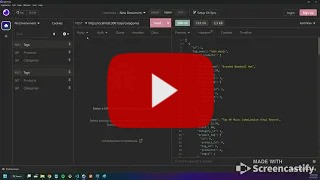

# 13 E-commerce Back End

## Table of Contents

1. [Description](#desc)
2. [Installation](#install)
3. [Usage](#usage)
4. [Demo](#demo)
5. [License](#license)

## Description 

Build the back end for an e-commerce site using Express.js API and configure it to use Sequelize to interact with a MySQL database.

 
## Installation

1. Clone this repo and update database credentials by entering your MySQL password located .env.EXAMPLE.
2. Rename the file to ".env".
3. Upload SQL script to your database, which is located in db > schema.sql.
4. Seed the database by entering `npm run seed` into your terminal.
5. Install this application's dependencies by entering `npm i` into your terminal.
6. Invoke app by entering `node server.js` into your terminal.

 
## Usage

- Use Insomnia Core to test CRUD on products, categories and tags.

 
## Demo

Here's a [video](https://youtu.be/jHAHlcqZ-iI) of the application in use on Insomnia Core.

 
## License

All code is released under the [GNU General Public License](https://www.gnu.org/licenses/gpl-3.0.en.html).